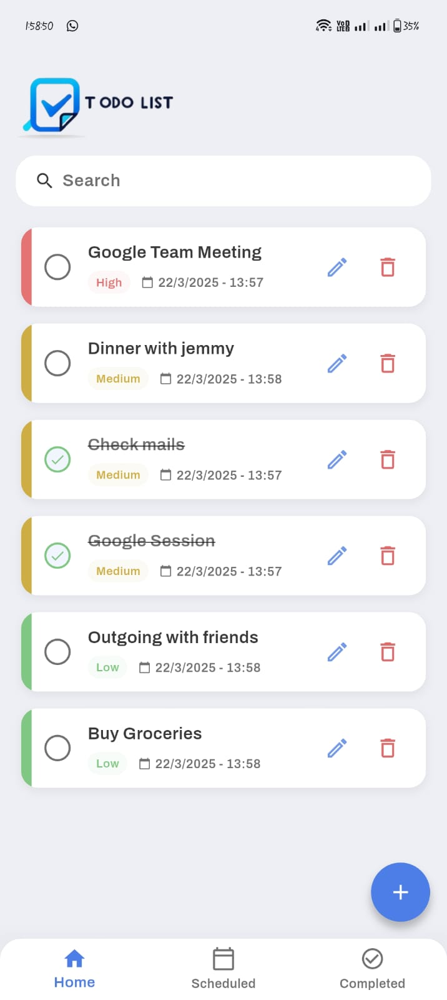
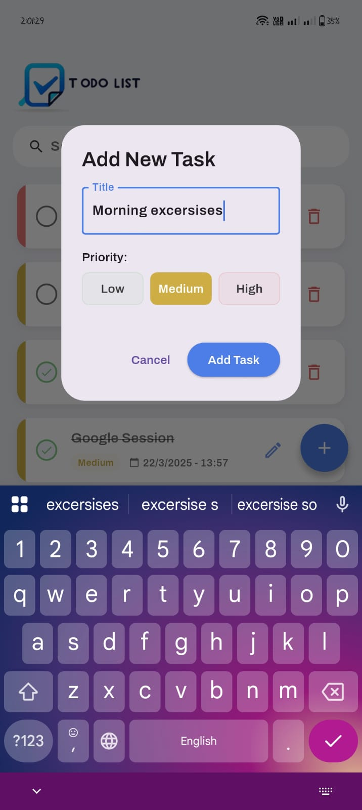
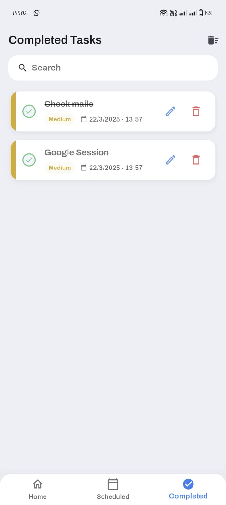
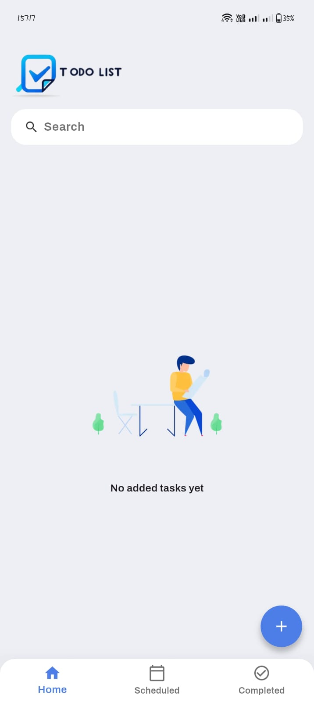

# Listify - A Modern Todo List App ✅

<p align="center">
  
</p>

<p align="center">
  <b>A beautiful and intuitive Todo List application built with Flutter</b>
</p>

<p align="center">
  <a href="#features">Features</a> •
  <a href="#screenshots">Screenshots</a> •
  <a href="#installation">Installation</a> •
  <a href="#usage">Usage</a> •
  <a href="#technologies">Technologies</a> •
  <a href="#contributing">Contributing</a> •
  <a href="#license">License</a>
</p>

## Features

✨ **Beautiful UI/UX Design**: Clean and intuitive interface for managing tasks

🔄 **Task Management**: Create, edit, delete, and mark tasks as completed

🎯 **Priority Levels**: Assign high, medium, or low priority to your tasks

🔍 **Task Filtering**: Easily filter tasks by their status or priority

💾 **Local Storage**: Your tasks are saved locally and persist between sessions

🌙 **Dark Mode Support**: Switch between light and dark themes

## Screenshots

<p align="center">
  
  &nbsp;&nbsp;&nbsp;&nbsp;
  
  &nbsp;&nbsp;&nbsp;&nbsp;
  
  &nbsp;&nbsp;&nbsp;&nbsp;
  
  &nbsp;&nbsp;&nbsp;&nbsp;
  
</p>

## Installation

### Prerequisites

- Flutter SDK (version 3.7.2 or higher)
- Dart SDK (version 3.0.0 or higher)
- Android Studio / Xcode

### Steps

1. Clone this repository

```bash
git clone https://github.com/yourusername/taskmaster.git
```

2. Navigate to the project folder

```bash
cd taskmaster
```

3. Install dependencies

```bash
flutter pub get
```

4. Run the app

```bash
flutter run
```

## Usage

### Adding a new task

1. Tap the "+" button at the bottom of the home screen
2. Enter the task title and description
3. Select a priority level
4. Tap "Save" to add the task

### Completing a task

- Tap on the checkbox next to a task to mark it as completed

### Editing a task

- Long press on a task to open the edit menu

## Technologies

- **Flutter**: UI framework for cross-platform development
- **Shared Preferences**: Local storage solution

## Contributing

Contributions are welcome! Please feel free to submit a Pull Request.

1. Fork the Project
2. Create your Feature Branch (`git checkout -b feature/AmazingFeature`)
3. Commit your Changes (`git commit -m 'Add some AmazingFeature'`)
4. Push to the Branch (`git push origin feature/AmazingFeature`)
5. Open a Pull Request

## License

Distributed under the MIT License. See `LICENSE` for more information.

---

<p align="center">
  Made with ❤️ by Ahmed Marzok
</p>
