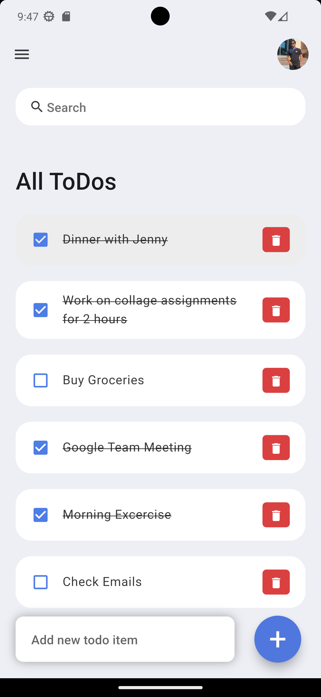
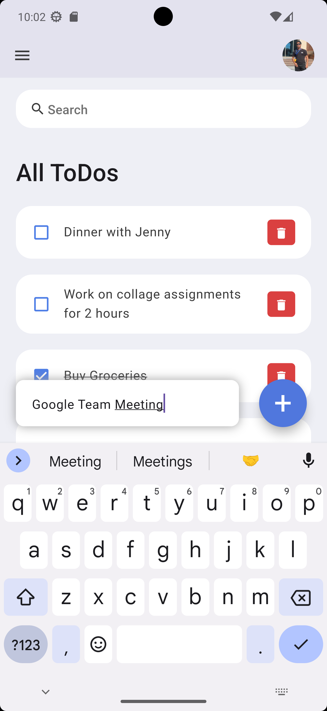
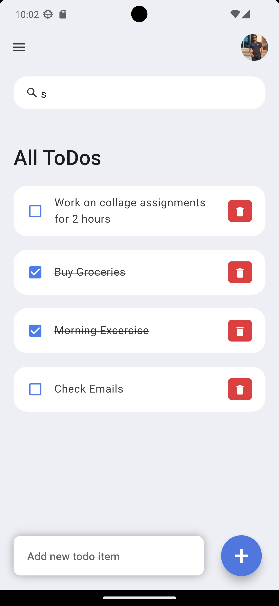

# Listify - A Modern Todo List App

<p align="center">
  
</p>

## 📱 Overview

Listify is a sleek, intuitive todo list application built with Flutter. It helps users organize their daily tasks with a clean and modern interface. The app allows users to add, delete, and mark tasks as complete, with a search functionality to easily find specific tasks.

## ✨ Features

- **Task Management**: Add, delete, and mark tasks as complete
- **Search Functionality**: Quickly find tasks with the search bar
- **Clean UI**: Modern and intuitive user interface
- **Responsive Design**: Works on various screen sizes and orientations

## 📸 Screenshots

<p align="center">
  
  
  
</p>

## 🛠️ Tech Stack

- **Framework**: Flutter
- **Language**: Dart
- **Architecture**: Stateful Widget Pattern
- **UI Components**: Custom widgets for todo items and search box

## 📋 Requirements

- Flutter SDK: >=3.3.4 <4.0.0
- Dart SDK: >=3.0.0 <4.0.0
- Android: minSdkVersion 16
- iOS: iOS 11.0 or newer

## 🚀 Installation

1. **Clone the repository**

   ```bash
   git clone https://github.com/yourusername/listify.git
   cd listify
   ```

2. **Install dependencies**

   ```bash
   flutter pub get
   ```

3. **Run the app**
   ```bash
   flutter run
   ```

## 📝 Usage

1. **Add a new task**: Type your task in the text field at the bottom and press the "+" button
2. **Mark a task as complete**: Tap the checkbox next to a task
3. **Delete a task**: Tap the delete icon on the right side of a task
4. **Search for tasks**: Type in the search box at the top of the screen

## 🧩 Project Structure

lib/
├── constants/
│ └── colors.dart # App color definitions
├── model/
│ └── todo.dart # Todo data model
├── screens/
│ └── home.dart # Main screen of the app
├── widgets/
│ ├── search_box.dart # Search functionality widget
│ └── todo_item.dart # Individual todo item widget
└── main.dart # Entry point of the application

## 🔮 Future Enhancements

- **Local Storage**: Persist todos using shared preferences or SQLite
- **Cloud Sync**: Sync todos across multiple devices
- **Categories**: Organize todos into different categories
- **Due Dates**: Add due dates and reminders for tasks
- **Dark Mode**: Implement a dark theme option
- **Animations**: Add smooth transitions and animations

## 🤝 Contributing

Contributions are welcome! Please feel free to submit a Pull Request.

1. Fork the repository
2. Create your feature branch (`git checkout -b feature/amazing-feature`)
3. Commit your changes (`git commit -m 'Add some amazing feature'`)
4. Push to the branch (`git push origin feature/amazing-feature`)
5. Open a Pull Request

## 📄 License

This project is licensed under the MIT License - see the [LICENSE](LICENSE) file for details.

## 👨‍💻 Author

- **Your Name** - [GitHub Profile](https://github.com/yourusername)

## 🙏 Acknowledgements

- [Flutter](https://flutter.dev/) - Beautiful native apps in record time
- [Material Design](https://material.io/design) - Design system that helps teams build high-quality digital experiences
